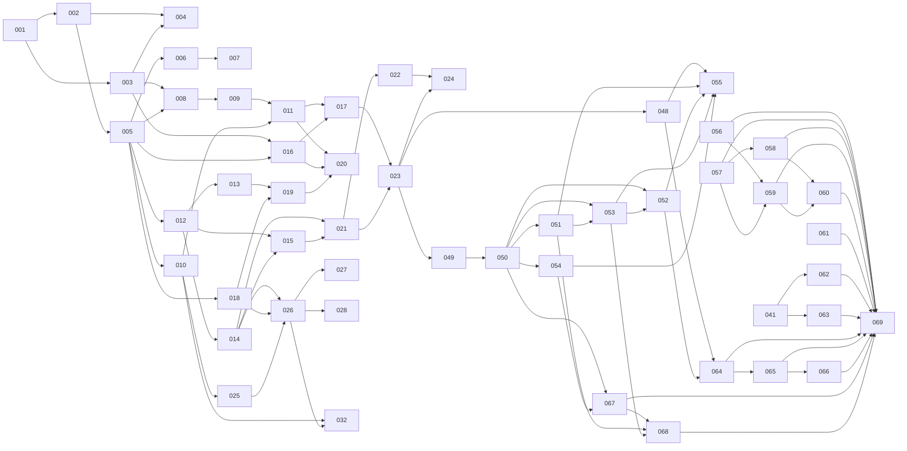

# Straticate Roadmap

This is the feature ledger and dependency graph for Straticate. It must be kept
current: every feature PR updates its own ledger row (status, branch, PR).

Feature numbers are zero-padded, sequential, and **never reused**. The number
appears in the branch name (`NNN-short-description`), the PR title
(`[NNN] Title`), and the feature document (`docs/features/NNN-*.md`).

Statuses: `PLANNED → READY → IN PROGRESS → PR OPEN → MERGED` (plus `BLOCKED`).

## Milestones

### M1 — Fake-separator end-to-end (first major technical milestone)

The complete workflow, with **no real ML model**:

```text
Open Straticate → drag/drop audio → upload succeeds → metadata appears
→ select separation mode → start job → fake inference begins
→ real-time WebSocket progress → model/GPU-style telemetry → cancel works
→ job completes → placeholder stems appear → preview (solo/mute/seek) works
→ export works
```

**Formal acceptance:** a person can run backend + frontend locally per
DEVELOPMENT.md and perform every step above against the fake separator, with
all normal CI green, on a machine with no GPU. Requires features 001–024.

### M2 — First real separation

HQ vocal separation (RoFormer-family) on CUDA with CPU fallback, verified
model download, real chunk progress, real telemetry. Features 025–026.

### M3 — v0.1.0 release

**Redefined 2026-08-25.** The original wording required "Fast + HQ vocal
models", but feature 027 (fast vocals, MDX-family) is closed `WONTFIX`: no party
with standing has stated a licence for those weights, and restrictive terms are
workable where silence is not. The milestone is restated to what the project can
actually deliver rather than left asserting something unreachable.

| Requirement | State |
| --- | --- |
| HQ vocal separation | **done** — 026, Mel-Band RoFormer |
| 4-stem separation | **done** — 028, Demucs |
| Capability-driven mode selection | **done** — 010 derives modes from the catalog; 026 honours `Model.capabilities` at device resolution |
| Bounded VRAM | **done** — 038 streams the overlap-add onto the host. RoFormer's peak is flat *to the byte* at any length (1,526 MiB allocated, 2,981 whole-device, from 30 s to 60 min); Demucs' is flat to ~38 min and then rises 24× more slowly than before. Host RAM, not VRAM, now limits track length |
| Production build | **done** — 042; `uvicorn straticate.main:app` serves API and SPA on one port |
| Release preparation | **done** — 043; `CHANGELOG.md` written from the ledger for users, `backend/pyproject.toml` at `0.1.0`, and the whole workflow verified from a clean clone |

**The gap this milestone ships with, stated plainly:** the `vocals` mode has only
a high-quality tier, which runs at ~0.3× real time on CPU — roughly ten minutes
for a three-minute song without a GPU. `standard_stems` is the mode with a fast
CPU path (Demucs, 1.63× real time). Reopening the fast-vocals question needs a
model whose terms somebody with standing has stated; see
`docs/features/027-mdx-fast-separator.md`.

**M3 is complete: v0.1.0 is released.** The release PR (#66) rebase-merged
`release/v0.1.0` into `main`, the annotated tag `v0.1.0` exists, hotfix 047
(#69) landed on `main`, and `dev` was reconciled via #68 (with 047 brought
back to `dev` alongside this ledger update).

### M4 — v0.2.0: inspect like an editor

**Defined 2026-08-27.** The Inspect step grows from a transport into an
Audacity-like timeline: per-stem waveform lanes rendered from the audio the
player already decodes, a scrubbable playhead with audible preview, zoom,
loop regions, per-stem level faders — and the one known defect v0.1.0
shipped with (the unrecoverable result fetch) fixed. Features 048–055;
decisions and design in the feature docs.

| Requirement | State |
| --- | --- |
| Result fetch failure is recoverable in place | **done** — 048 (#72), a "Try again" button refetches the result |
| Per-stem waveform lanes on a shared time axis (hand-rolled canvas, no new runtime dependency) | **done** — 049 (#71) the peaks/geometry/engine seam, 050 (#74) the visible lanes; frontend still depends on exactly `react`/`react-dom` |
| Click/drag seek preserving the one-seek-per-gesture contract | **done** — 050 (#74); the timeline itself is the `role="slider"` seek control |
| Horizontal zoom + pan, keyboard transport, accessible seek control | **done** — 050 (#74) keyboard transport and the accessible control, 051 (#78) Ctrl+wheel zoom anchored at the cursor, toolbar/keyboard zoom anchored at the playhead, pan by wheel and scroll thumb, high-res tiles past base resolution |
| Audible Audacity-style scrub preview | **done** — 052 (#82); throwaway preview grains respect mute/solo/level and never rebuild the transport graph mid-drag |
| Loop / A-B region playback, sample-accurate across stems | **done** — 053 (#80); ruler drag, shift-drag, edge handles and transport buttons all reach one native loop set on every stem before one shared `start()`; a region is a trap, not a fence |
| Per-stem volume faders over the existing `setLevel` | **done** — 054 (#76); one fader per stem in the lane header, independent of mute/solo |
| CHANGELOG, version `0.2.0`, clean-clone verification | **done** — 055; see below |

**M4 is complete: v0.2.0 is released.** The release branch `release/v0.2.0`
was cut from `dev`, locally rebased onto `main` (patch-id dropped the
already-released commits, exactly as `CONTRIBUTING.md`'s rationale predicts),
and the release PR (#86) rebase-merged; `main`'s tip tree is byte-identical
to `dev`'s. The annotated tag `v0.2.0` triggered the release workflow, which
published **Straticate v0.2.0** on 2026-08-29. Feature 055 prepared `dev`
and stopped there, mirroring 043; the release steps were the owner's,
executed with the owner's explicit authorization.

### M5 — v0.3.0: durable, measured, polished

**Defined 2026-08-30** from a full backlog inventory (every unnumbered
ROADMAP item, every Known Limitations section in features 006–055, every
CHANGELOG caveat). Three themes, features 056–069; designs and stop
conditions in the feature docs.

| Requirement | Feature(s) |
| --- | --- |
| Job records, the upload registry and model-install failures survive a restart (JSON sidecars + read-only startup sweep; interrupted jobs become `failed`/`job_interrupted`, never re-queued) | 056, 057, 061 |
| Everything is deletable and disk use is visible: `DELETE /jobs/{id}` (stems + exports, one tree), disk-usage report, typed manual prune — never deleting unasked | 058, 059, 060 |
| Band-limited fold measured against 041's baselines — shipped as `mono_bass` only if it beats them, else a documented rejection | 062 |
| Wide-stereo detection per 041's handoff: suggest, never apply; false-positive rate measured on user-supplied ordinary tracks before the UI ships | 063 |
| A failed stem download is recoverable in place (engine reload path) | 064 |
| Playhead, loop, zoom and decoded stems survive leaving the Inspect step (engine lifetime = tracked job) and a page reload (persisted view state) | 065, 066 |
| Lane headers stop clipping at large browser fonts; fader target ≥ 24 px (WCAG 2.2), verified by a multi-root-font layout harness | 067 |
| Auto-follow no longer page-flips while looping inside a region | 068 |
| CHANGELOG, version `0.3.0`, clean-clone verification incl. restart survival | 069 |

Deferred to v0.4.0, deliberately: job history/multi-job UI, opt-in
auto-prune policies, resumable model downloads / update path /
re-verification, export transport (progress/cancel), streaming stem decode
(C12) and the zipper-noise level ramp (C9).

## Current state (2026-08-29)

**Every milestone is met and v0.2.0 is released** (tag `v0.2.0`, release PR
#86 rebase-merged 2026-08-29; v0.1.0: tag `v0.1.0`, PR #66, hotfix #69).
Every feature 048–054 is merged and 055 was the release preparation:
`CHANGELOG.md` carries the `[0.2.0]` entry written from this ledger,
`backend/pyproject.toml` is at `0.2.0`, and the workflow (including the new
timeline surface) was verified from a clean clone. No release-branch fixes
were made, so there is nothing to reconcile back into `dev`. Details in
`docs/features/055-release-preparation-v0.2.0.md`. Nothing after v0.2.0 is
numbered yet; candidate follow-ups live in the feature docs' known
limitations (lane-height/fader-target sizing, stem-download retry, playhead
persistence across phases, auto-follow under a loop) and in the
still-standing items under "After v0.1.0" below.

The remainder of this section is the v0.1.0 state as recorded at release.

**M1, M2 and M3 are all met, and `dev` is prepared for the v0.1.0 release.**
Every numbered feature 001–045 is merged or resolved — 027 `WONTFIX` (no licence
with standing for the MDX-family weights) and 007 folded into 006; 043 is the
release preparation itself. **935 backend tests and 802 frontend tests**, all
CI-enforced, the backend suite clean under `-W error`.

**046 is the exception to that range** and is deliberately not on `dev`: it adds
the tag-triggered release workflow and corrects the release process in
`CONTRIBUTING.md`, on the `release/v0.1.0` branch, because it is the release
itself that needs it. It reaches `dev` through the reconciliation step
`CONTRIBUTING.md` already required.

The release notes are [CHANGELOG.md](CHANGELOG.md), written from this ledger for
users rather than as a commit log: what the application does, what it needs, and
— the section that took the most care — what it cannot do. Everything the
release ships with a caveat is recorded there with the measurement behind it.

**What is left is the project owner's**, per `AGENTS.md`: the release PR
`dev → main`, the merge, and the annotated tag `v0.1.0`. Feature 043 does not
create, merge or tag anything.

Verified on 2026-08-26 from a clean clone of `dev` on Windows 11, following
`README.md` verbatim: `npm ci && npm run build` (8.9 s / 10.5 s),
`uv sync --extra torch` (23.5 s), `uv run python -m straticate`, then the
workflow at `127.0.0.1:8000` — install the 80.2 MB Standard Stems weights,
upload, configure, separate, watch live chunk progress and telemetry, play the
stems, export. 20 s of audio separated in **11.84 s of processing, real-time
factor 1.689** on CPU, against 028's published 1.63–1.64.
`GET /api/v1/version` answered `0.1.0` and the header read `backend v0.1.0`.
No console errors, no warnings in the server log. Details in
`docs/features/043-release-preparation.md`.

### M2 — first real separation

Straticate performs a genuine vocal separation. A vendored Mel-Band RoFormer
(MIT) runs the Kim Vocal 2 checkpoint (MIT since 2026-04-22) behind the
existing `Separator` seam, with weights installed and SHA-256-verified by
feature 025.

**Separation quality, measured against ground truth** — a 20 s mixture built
from a locally synthesised speech track over a generated backing, so the true
sources were known:

| correlation | value |
| --- | --- |
| vocals stem ↔ true voice | **+0.993** |
| vocals stem ↔ true backing | −0.001 |
| instrumental stem ↔ true backing | **+1.000** |
| instrumental stem ↔ true voice | +0.003 |
| *mixture* ↔ true voice (baseline) | +0.231 |

The mixture correlates with the voice at 0.23 and the extracted stem at 0.99:
separation, not a passthrough. The baseline row is what makes it a measurement
rather than a number.

**CUDA is verified.** Executed 2026-08-25 on an NVIDIA GeForce RTX 4060 Laptop
GPU (8188 MiB, driver 610.47 / CUDA 13.3) with `torch 2.13.0+cu130`. Feature
018's design held exactly as written — swapping the wheel made `cuda:0` appear
first with **no code, settings, API or schema change**, and jobs resolved to it
automatically.

| | CPU | cuda:0 |
| --- | --- | --- |
| 30 s clip, wall clock | 100.5 s | **6.7 s** |
| real-time factor | 0.299 | **4.496** |
| gpu telemetry block | `null` (correct CPU shape) | measured |

**~15× faster than CPU, and faster than real time** — a 3-minute track separates
in about 40 s instead of 10 minutes. Measured VRAM on that run: 1,082 MiB
allocated, **1,634 MiB peak** of 8,188 MiB — a short-clip figure; see 036 for
how it scales. With `nvidia-ml-py` present the optional NVML
fields report too (utilization 1.0, 59–62 °C); without it they are `null`, which
the contract permits.

The full integration tier passes (4/4), including the previously-never-executed
`@pytest.mark.gpu` test, and a job driven through the real API resolved to
`cuda:0`, reported real chunk progress, and delivered a `runtime_metrics` event
carrying genuine GPU figures over the WebSocket.

Four defects that only a GPU could reveal are recorded as feature **036** —
notably the catalog's `recommended_vram_mb: 8192`, which was never measured.
**036 re-measured it and the "wrong by more than 5×" reading above did not
survive**: peak allocation is not bounded by chunking (it grows ~1.35 MiB per
second of audio, reaching 2,343 MiB on a 10-minute track), and what a card must
have free is roughly twice the allocated figure once the CUDA context and the
allocator's reservation are counted — 4,213 MiB for that track. The corrected
entry is `recommended_vram_mb: 6144` with a new `minimum_vram_mb: 4096` floor;
036's document carries the method and the full sweeps. **Feature 038 has since
superseded both figures**: streaming the overlap-add onto the host made the peak
flat with track length, and the entry now reads `recommended_vram_mb: 4096` /
`minimum_vram_mb: 4096` — see 038's document for the before-and-after sweep.


### M1 — fake-separator end-to-end

Met earlier the same day and verified by hand in a browser: upload → catalog-driven
configuration → job → live chunk progress → telemetry → cancel → synchronized
stem playback with solo/mute/seek → export. See the git history of this section.

### After v0.1.0

**Status as of M5 planning (2026-08-30):** the retry defect became **048**
(fixed, #72); retention/pruning and job-record persistence became **056–060**;
wide-stereo detection became **063** and the band-limited fold **062**; the
fast-vocals question stays licence-blocked (027's reopen criterion stands,
re-checked at each release prep). Still unnumbered: the `scripts/`/`testdata/`
doc drift. The final two bullets below are resolution records (037's
quality-tier decision; 032's history), not open items. The bullets are kept
verbatim as the planning record they were.

- **`StemPlayer` cannot recover from a failed result fetch.** One `useEffect`,
  one `getSeparationResult`, no retry — a single dropped request leaves the
  Inspect step permanently reading "Something went wrong. Please try again."
  with no control that tries again. Found and quantified by **044** (finding 2)
  and deliberately not fixed there. The smallest real defect in the release and
  the cheapest to fix. **Fixed by feature 048 (#72).**
- **Nothing prunes job outputs, exports or uploads.** 021, 022, 024 and 040 each
  recorded it and none of them owns it: disk use grows with every job forever,
  deleting an uploaded file leaves its stems behind, and the free-space warning
  040 added covers the *models* directory only. No feature owns retention.
- **Job records do not survive a restart** (012, 015, 021), so stems that exist
  on disk become unreachable through the API. The UI explains it and offers a
  re-run, which is honest but is not persistence.
- **Wide-stereo detection**, which **041** deliberately left out and then handed
  everything to: the signal (full-band L/R correlation), the failing case
  (+0.23 against 0.7–0.95), a defensible threshold (below ~+0.5), what it must
  say, and what it must never do (apply anything). The one thing it has to
  measure for itself is the false-positive rate on ordinary modern tracks —
  every number 041 published is from **one** record.
- **A band-limited fold** — mono below a crossover, stereo above. 041 calls it
  the most promising unexplored option and did not ship it precisely because it
  was unmeasured.
- **A fast `vocals` tier** stays blocked on the same thing that closed 027: a
  model whose weights licence somebody with standing has stated.
- **`scripts/` and `testdata/` do not exist.** `README.md`, `ARCHITECTURE.md`
  and `DEVELOPMENT.md` all describe them; the repository has neither, and audio
  fixtures are generated into temporary directories at test time. Found by 043's
  clean-checkout run and left alone: it spans three documents that 043 does not
  own.
- Whether `quality_options` should hide tiers whose weights are not installed
  is **settled by 037: no.** Raised by 010 and deferred by 025, 026 and 032.
  Hiding makes the product silently differ from machine to machine, and on a
  default server — one mode, one real tier — it would empty the configure step
  with no explanation. The tier is also the only place a model's price, its
  hardware requirements and its licence can be read *before* the download, and
  the failure hiding was meant to prevent has been prevented directly since
  035, which disables "Start separation" with a stated reason until the weights
  are there. 037 acts on the decision rather than only recording it: every tier
  is now priced where it is chosen ("Needs a 870 MB download" / "Installed" /
  "Downloading its weights…" / "Its last install failed"), from `GET /models`,
  so a mode with several uninstalled tiers no longer has to be clicked through.
  Reasoning in `docs/features/037-model-management-ui.md`.
- **032 hides the development fixtures** from the user-facing catalog. Between
  032 and 028 a default server therefore offered a single separation mode
  (`vocals`, tier `high_quality`, `vocals-hq-001`) and `standard_stems` was
  absent entirely, having only a fixture behind it. Since 028 both modes are
  served — `standard_stems` at `balanced` via `standard-stems-001` — and a fresh
  checkout still requires a weights install (870 MiB or 80 MiB) before it can
  separate anything. `STRATICATE_INCLUDE_DEVELOPMENT_MODELS=1` restores the
  previous behaviour and is what CI, the backend suite and 030's Playwright tier
  set. The first-run install affordance this note used to be waiting for shipped
  in **035**, and **037** gave it a full model library.

## Feature ledger

| #   | Feature                                      | Status  | Depends on | Branch | PR |
|-----|----------------------------------------------|---------|------------|--------|----|
| 001 | Repository bootstrap (docs, contracts, plan) | MERGED  | —          | `001-repository-bootstrap` | #1 |
| 002 | Backend skeleton (FastAPI, tooling, health)  | MERGED  | 001        | `002-backend-skeleton` | #2 |
| 003 | Frontend skeleton (Vite/React/TS, shell)     | MERGED  | 001        | `003-frontend-skeleton` | #3 |
| 004 | CI pipeline (backend + frontend checks)      | MERGED  | 002, 003   | `004-ci-pipeline` | #4 |
| 005 | API contracts v1 (schemas, OpenAPI → TS)     | MERGED  | 002        | `005-api-contracts` | #5 |
| 006 | Audio upload + validation + temp storage     | MERGED  | 005        | `006-audio-upload` | #6 |
| 007 | Audio metadata extraction (ffprobe)          | MERGED  | 006        | folded into 006 | #6 |
| 008 | Drag-drop + file picker + upload state UI    | MERGED  | 003, 005   | `008-drag-drop-ui` | #7 |
| 009 | Metadata display UI                          | MERGED  | 008        | `009-metadata-display` | #10 |
| 010 | Model catalog + capabilities backend         | MERGED  | 005        | `010-model-catalog` | #11 |
| 011 | Separation mode + quality selection UI       | MERGED  | 009, 010*, 015, 016 | `011-mode-selection-ui` | #19 |
| 012 | Job manager (queue, states, cancellation)    | MERGED  | 005        | `012-job-manager` | #8 |
| 013 | WebSocket event hub + typed events           | MERGED  | 012        | `013-websocket-hub` | #13 |
| 014 | Separator interface + FakeSeparator          | MERGED  | 012        | `014-fake-separator` | #15 |
| 015 | Job REST endpoints (create/get/cancel/list)  | MERGED  | 012, 014   | `015-job-endpoints` | #17 |
| 016 | Frontend job + WebSocket clients             | MERGED  | 003, 005*  | `016-job-ws-clients` | #14 |
| 017 | Progress UI + cancel + error handling        | MERGED  | 011, 015, 016 | `017-progress-cancel-ui` | #23 |
| 018 | Compute device detection + devices API       | MERGED  | 005        | `018-device-detection` | #12 |
| 019 | Runtime telemetry sampler + metrics events   | MERGED  | 013, 018   | `019-telemetry-sampler` | #21 |
| 020 | Telemetry panel UI (model/GPU/processing)    | MERGED  | 011, 016, 019* | `020-telemetry-panel` | #22 |
| 021 | Result management + stem serving             | MERGED  | 014, 015   | `021-result-serving` | #20 |
| 022 | Stem export (WAV24/float32/FLAC)             | MERGED  | 021        | `022-stem-export` | #25 |
| 023 | Stem player UI (sync playback, solo, mute)   | MERGED  | 017, 021   | `023-stem-player` | #26 |
| 024 | Export UI                                    | MERGED  | 022, 023   | `024-export-ui` | #27 |
| 025 | Model download manager (SHA-256, atomic)     | MERGED  | 010        | `025-model-download-manager` | #30 |
| 026 | Real separator: HQ vocals (Mel-Band RoFormer)| MERGED  | 014, 018, 025 | `026-roformer-separator` | #33 |
| 027 | Real separator: fast vocals (MDX-family)     | WONTFIX | 026        | | licence unstated — see docs/features/027 |
| 028 | 4-stem separation (Demucs)                   | MERGED  | 026        | `028-demucs-four-stem` | #45 |
| 029 | Skeleton hardening (deferred review finds)  | MERGED  | 004, 005   | `029-skeleton-hardening` | #29 |
| 030 | Playwright E2E tier (fake separator)         | MERGED  | 024        | `030-playwright-e2e` | #35 |
| 031 | Post-029 review findings                     | MERGED  | 029        | `031-post-029-findings` | #32 |
| 032 | Keep development models out of user catalog  | MERGED  | 010, 026   | `032-hide-development-models` | #36 |
| 033 | Session survives a page reload               | MERGED  | 016, 017   | `033-session-survives-reload` | #39 |
| 034 | Lazy separator builders (torch optional again)| MERGED  | 026        | `034-lazy-separator-builders` | #40 |
| 035 | First-run model install affordance (UI)      | MERGED  | 025, 032   | `035-install-affordance` | #41 |
| 036 | GPU validation follow-ups                    | MERGED  | 026, 029   | `036-gpu-validation-followups` | #42 |
| 037 | Model management UI (install/remove/browse)  | MERGED  | 025, 035   | `037-model-management-ui` | #44 |
| 038 | Streaming overlap-add (bounded VRAM)         | MERGED  | 026, 028, 039 | `038-streaming-overlap-add` | #55 |
| 039 | Shared separator skeleton (de-duplicate)     | MERGED  | 026, 028   | `039-shared-separator-skeleton` | #48 |
| 040 | Free-disk-space endpoint for installs        | MERGED  | 025, 037   | `040-free-disk-space-endpoint` | #49 |
| 041 | Mono fold-down for wide-stereo material      | MERGED  | 028        | `041-mono-folddown-option` | #57 |
| 042 | Production build (backend serves frontend)   | MERGED  | 003, 024   | `042-production-build` | #53 |
| 043 | Release preparation for v0.1.0               | MERGED  | 038, 042   | `043-release-preparation` | #62 |
| 044 | Playwright tier stability under load         | MERGED  | 030        | `044-e2e-stability` | #58 |
| 045 | Fake separator must not block the event loop | MERGED  | 041, 044   | `045-fake-separator-event-loop` | #60 |
| 046 | Release workflow and release-process corrections | MERGED  | 043        | `046-release-workflow` | #65 |
| 047 | Release workflow: ask GitHub whether the tag is annotated | MERGED | 046        | `hotfix/release-workflow-annotated-tag` | #69 |
| 048 | Stem player recovers from a failed result fetch | MERGED  | 023        | `048-result-fetch-retry` | #72 |
| 049 | Waveform foundation (peaks, geometry, engine seam) | MERGED  | 023        | `049-waveform-foundation` | #71 |
| 050 | Stem timeline with per-stem waveform lanes   | MERGED  | 049        | `050-stem-timeline-lanes` | #74 |
| 051 | Timeline zoom and pan                        | MERGED  | 050        | `051-timeline-zoom-pan` | #78 |
| 052 | Audible scrub preview                        | MERGED  | 050, 053   | `052-scrub-preview` | #82 |
| 053 | Loop / A-B region playback                   | MERGED  | 050, 051   | `053-loop-region` | #80 |
| 054 | Per-stem level faders                        | MERGED  | 050        | `054-stem-level-faders` | #76 |
| 055 | Release preparation for v0.2.0               | MERGED  | 048–054    | `055-release-preparation-v0.2.0` | #84 |
| 056 | Durable upload registry                      | MERGED  | —          | `056-durable-upload-registry` | #90 |
| 057 | Durable job records + interrupted recovery   | MERGED  | —          | `057-durable-job-records` | #92 |
| 058 | Job deletion + exports authority in layout   | MERGED  | 057        | `058-job-deletion` | #98 |
| 059 | Disk-usage endpoint                          | MERGED  | 056, 057   | `059-disk-usage-endpoint` | #95 |
| 060 | Prune endpoint                               | MERGED  | 058, 059   | `060-prune-endpoint` | #101 |
| 061 | Persist model install failures               | MERGED  | —          | `061-persist-install-failures` | #89 |
| 062 | Band-limited fold (measure; `mono_bass` or documented rejection) | MERGED | 041 | `062-band-limited-fold` | #100 |
| 063 | Wide-stereo detection + suggestion           | PR OPEN | 041        | `063-wide-stereo-detection` | #104 |
| 064 | Stem-audio retry + player hygiene            | MERGED  | 048, 052   | `064-stem-retry-hygiene` | #91 |
| 065 | Job-scoped stem session (engine hoist)       | MERGED  | 064        | `065-stem-session` | #96 |
| 066 | View state survives a reload                 | MERGED  | 033, 065   | `066-view-state-reload` | #102 |
| 067 | Lane height + fader accessibility            | MERGED  | 050, 054   | `067-lane-height-a11y` | #94 |
| 068 | Auto-follow suppressed inside a loop region  | MERGED  | 051, 053, 067 | `068-auto-follow-loop` | #97 |
| 069 | Release preparation for v0.3.0               | PLANNED | 056–068    | `069-release-preparation-v0.3.0` | |

`*` = depends only on that feature's *contract* (schemas/mocks), not its
implementation — the frontend feature may proceed against documented contracts,
generated types, and mock responses/events.

## Dependency graph



## Parallel tracks

Backend and frontend proceed in parallel once a contract exists. Shared
contracts are established **first** (feature 005 and per-feature schema
additions); two agents never independently redefine the same contract.

```text
Backend track                      Frontend track
─────────────                      ──────────────
002 backend skeleton          ∥    003 frontend skeleton
005 API contracts v1               (frontend consumes generated types)
006 upload · 007 metadata     ∥    008 drop/picker UI · 009 metadata UI
010 model catalog             ∥    011 mode/quality selection
012 jobs · 013 WS · 014 fake  ∥    016 job/WS clients · 017 progress UI
018 devices · 019 telemetry   ∥    020 telemetry panel
021 results · 022 export      ∥    023 stem player · 024 export UI
```

Safe concurrency rule of thumb: features in different tracks with all
dependencies MERGED (or contract-only `*` dependencies documented) may run
simultaneously. Features touching `backend/src/straticate/schemas/` serialize
with each other.

## Phases (development plan)

- **Phase 0 — Repository:** 001, 002, 003, 004
- **Phase 1 — Contracts & skeletons:** 005 (plus 002/003 hardening)
- **Phase 2 — File ingestion:** 006, 007, 008, 009
- **Phase 3 — Separation configuration:** 010, 011
- **Phase 4 — Job infrastructure:** 012, 013, 014, 015, 016, 017
- **Phase 5 — Telemetry:** 018, 019, 020
- **Phase 6 — Results (fake stems):** 021, 022, 023, 024 → **M1**
- **Phase 7 — Real inference:** 025, 026 → **M2**
- **Phase 8 — Additional models:** 027, 028
- **Phase 9 — Model management UI, remote catalog, updates/removal** (features
  numbered when planned)
- **Phase 10 — Release:** production build, deployment docs, release
  automation → **v0.1.0** (M3)
- **Phase 11 — Waveform timeline:** 048, 049, 050, 051, 052, 053, 054,
  055 → **v0.2.0** (M4)
- **Phase 12 — Durability, measured quality, timeline polish:** 056, 057,
  058, 059, 060, 061, 062, 063, 064, 065, 066, 067, 068, 069 → **v0.3.0**
  (M5)

Note the deliberate ordering: results/preview/export (Phase 6) is built against
the fake separator *before* real inference (Phase 7), so M1 proves the entire
application shell without ML risk.

## Initial agent assignments

| Agent | Feature | Notes |
| --- | --- | --- |
| Agent A (backend) | 002 | then 005 (contracts are backend-owned) |
| Agent B (frontend) | 003 | then 008 once 005's contracts merge |
| Agent C (infra) | 004 | after 002 + 003 merge |

Every assignment must follow the template in [AGENTS.md](AGENTS.md): feature
number, title, branch, objective, dependencies, scope, out-of-scope, expected
files, acceptance criteria, required tests.
