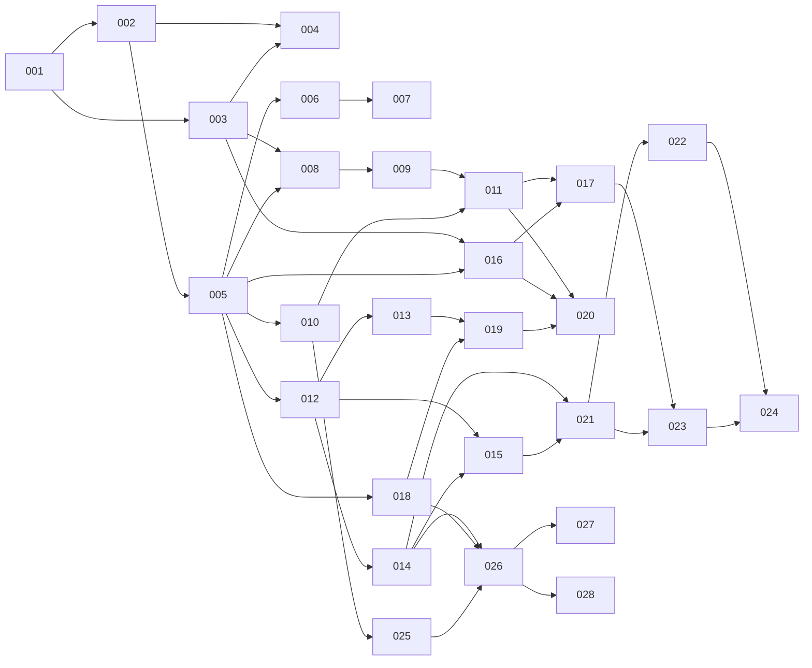

# Straticate Roadmap

This is the feature ledger and dependency graph for Straticate. It must be kept
current: every feature PR updates its own ledger row (status, branch, PR).

Feature numbers are zero-padded, sequential, and **never reused**. The number
appears in the branch name (`NNN-short-description`), the PR title
(`[NNN] Title`), and the feature document (`docs/features/NNN-*.md`).

Statuses: `PLANNED → READY → IN PROGRESS → PR OPEN → MERGED` (plus `BLOCKED`).

## Milestones

### M1 — Fake-separator end-to-end (first major technical milestone)

The complete workflow, with **no real ML model**:

```text
Open Straticate → drag/drop audio → upload succeeds → metadata appears
→ select separation mode → start job → fake inference begins
→ real-time WebSocket progress → model/GPU-style telemetry → cancel works
→ job completes → placeholder stems appear → preview (solo/mute/seek) works
→ export works
```

**Formal acceptance:** a person can run backend + frontend locally per
DEVELOPMENT.md and perform every step above against the fake separator, with
all normal CI green, on a machine with no GPU. Requires features 001–024.

### M2 — First real separation

HQ vocal separation (RoFormer-family) on CUDA with CPU fallback, verified
model download, real chunk progress, real telemetry. Features 025–026.

### M3 — v0.1.0 release

Fast + HQ vocal models, 4-stem model, capability-driven mode selection,
production build, release automation. Release PR `dev → main`, tag `v0.1.0`.

## Current state (2026-08-24)

**Milestone M1 is met.** Features 001–024 are merged into `dev`.
**442 backend tests and 517 frontend tests**, all CI-enforced on every PR.

M1's formal acceptance is that *a person* can run backend + frontend locally per
DEVELOPMENT.md and perform the whole workflow against the fake separator, with
CI green, on a machine with no GPU. That was carried out by hand in a browser on
2026-08-24 against a real uvicorn backend and Vite dev server on a CPU-only
host (no `torch` installed, so `GET /system/devices` reports CPU only):

| Step | Observed |
| --- | --- |
| Upload | 3-minute MP3 accepted; ffprobe metadata rendered, `bit_depth` row correctly absent for a lossy source |
| Configure | Modes, stem lists and quality tiers rendered from `/separation-modes`; 4-stem mode selected |
| Separate | Job created, returned immediately, ran to `completed` at **12.4x real time** |
| Progress | Live chunk-grained progress over WebSocket (36 chunks), stage, elapsed, audio processed |
| Telemetry | Model / device / processing panel populated, including real-time factor |
| Cancel | A separate 10-minute job cancelled mid-run: settled on `cancelled` naming the stage, **no partial stem left on disk**, re-cancel idempotent |
| Inspect | All four stems loaded and played in sync off one clock; solo and mute per stem; scrubber and time readout |
| Export | 3-of-4 stem subset exported as `wav_pcm24`; server produced `vocals/drums/other.wav` + `separation.json`, with `bass` correctly excluded |
| Round trip | "Start another separation" returned to `configure` with the uploaded file retained |

Playback ran uninterrupted while the export transcoded, confirming the export
path does not block the event loop.

One caveat on the export step: the browser automation context suppresses
page-initiated downloads, so the file landing on the user's disk could not be
observed — the server-side artifact was verified instead, and the UI's success
line reflects the fetch completing rather than a confirmed disk write (recorded
as a known limitation in `docs/features/024-export-ui.md`).

Working today: the complete `select -> configure -> separate -> inspect ->
export` workflow, end to end, with no ML model.

**Next up — M2 (features 025, 026).** Real HQ vocal separation on CUDA with CPU
fallback, which needs the model download manager (025) first. Feature **029**
runs first and clears the way: it fixes the deferred review findings from five
PRs (#5, #8, #17, #20, #25), and leaves two items recorded for **026** to carry
out (separator construction on the event loop; `Model.capabilities` never
consulted when resolving a device). The Playwright E2E tier that DEVELOPMENT.md
once scheduled "around M1" is now feature **030**, split out of 029 because it
is a new test tier rather than a deferred fix.

## Feature ledger

| #   | Feature                                      | Status  | Depends on | Branch | PR |
|-----|----------------------------------------------|---------|------------|--------|----|
| 001 | Repository bootstrap (docs, contracts, plan) | MERGED  | —          | `001-repository-bootstrap` | #1 |
| 002 | Backend skeleton (FastAPI, tooling, health)  | MERGED  | 001        | `002-backend-skeleton` | #2 |
| 003 | Frontend skeleton (Vite/React/TS, shell)     | MERGED  | 001        | `003-frontend-skeleton` | #3 |
| 004 | CI pipeline (backend + frontend checks)      | MERGED  | 002, 003   | `004-ci-pipeline` | #4 |
| 005 | API contracts v1 (schemas, OpenAPI → TS)     | MERGED  | 002        | `005-api-contracts` | #5 |
| 006 | Audio upload + validation + temp storage     | MERGED  | 005        | `006-audio-upload` | #6 |
| 007 | Audio metadata extraction (ffprobe)          | MERGED  | 006        | folded into 006 | #6 |
| 008 | Drag-drop + file picker + upload state UI    | MERGED  | 003, 005   | `008-drag-drop-ui` | #7 |
| 009 | Metadata display UI                          | MERGED  | 008        | `009-metadata-display` | #10 |
| 010 | Model catalog + capabilities backend         | MERGED  | 005        | `010-model-catalog` | #11 |
| 011 | Separation mode + quality selection UI       | MERGED  | 009, 010*, 015, 016 | `011-mode-selection-ui` | #19 |
| 012 | Job manager (queue, states, cancellation)    | MERGED  | 005        | `012-job-manager` | #8 |
| 013 | WebSocket event hub + typed events           | MERGED  | 012        | `013-websocket-hub` | #13 |
| 014 | Separator interface + FakeSeparator          | MERGED  | 012        | `014-fake-separator` | #15 |
| 015 | Job REST endpoints (create/get/cancel/list)  | MERGED  | 012, 014   | `015-job-endpoints` | #17 |
| 016 | Frontend job + WebSocket clients             | MERGED  | 003, 005*  | `016-job-ws-clients` | #14 |
| 017 | Progress UI + cancel + error handling        | MERGED  | 011, 015, 016 | `017-progress-cancel-ui` | #23 |
| 018 | Compute device detection + devices API       | MERGED  | 005        | `018-device-detection` | #12 |
| 019 | Runtime telemetry sampler + metrics events   | MERGED  | 013, 018   | `019-telemetry-sampler` | #21 |
| 020 | Telemetry panel UI (model/GPU/processing)    | MERGED  | 011, 016, 019* | `020-telemetry-panel` | #22 |
| 021 | Result management + stem serving             | MERGED  | 014, 015   | `021-result-serving` | #20 |
| 022 | Stem export (WAV24/float32/FLAC)             | MERGED  | 021        | `022-stem-export` | #25 |
| 023 | Stem player UI (sync playback, solo, mute)   | MERGED  | 017, 021   | `023-stem-player` | #26 |
| 024 | Export UI                                    | MERGED  | 022, 023   | `024-export-ui` | #27 |
| 025 | Model download manager (SHA-256, atomic)     | PLANNED | 010        | | |
| 026 | Real separator: HQ vocals (RoFormer-family)  | PLANNED | 014, 018, 025 | | |
| 027 | Real separator: fast vocals (MDX-family)     | PLANNED | 026        | | |
| 028 | 4-stem model + capability-driven modes       | PLANNED | 026        | | |
| 029 | Skeleton hardening (deferred review findings)| PR OPEN | 004, 005   | `029-skeleton-hardening` | #29 |
| 030 | Playwright E2E tier (fake separator)         | PLANNED | 024        | | |

`*` = depends only on that feature's *contract* (schemas/mocks), not its
implementation — the frontend feature may proceed against documented contracts,
generated types, and mock responses/events.

## Dependency graph



## Parallel tracks

Backend and frontend proceed in parallel once a contract exists. Shared
contracts are established **first** (feature 005 and per-feature schema
additions); two agents never independently redefine the same contract.

```text
Backend track                      Frontend track
─────────────                      ──────────────
002 backend skeleton          ∥    003 frontend skeleton
005 API contracts v1               (frontend consumes generated types)
006 upload · 007 metadata     ∥    008 drop/picker UI · 009 metadata UI
010 model catalog             ∥    011 mode/quality selection
012 jobs · 013 WS · 014 fake  ∥    016 job/WS clients · 017 progress UI
018 devices · 019 telemetry   ∥    020 telemetry panel
021 results · 022 export      ∥    023 stem player · 024 export UI
```

Safe concurrency rule of thumb: features in different tracks with all
dependencies MERGED (or contract-only `*` dependencies documented) may run
simultaneously. Features touching `backend/src/straticate/schemas/` serialize
with each other.

## Phases (development plan)

- **Phase 0 — Repository:** 001, 002, 003, 004
- **Phase 1 — Contracts & skeletons:** 005 (plus 002/003 hardening)
- **Phase 2 — File ingestion:** 006, 007, 008, 009
- **Phase 3 — Separation configuration:** 010, 011
- **Phase 4 — Job infrastructure:** 012, 013, 014, 015, 016, 017
- **Phase 5 — Telemetry:** 018, 019, 020
- **Phase 6 — Results (fake stems):** 021, 022, 023, 024 → **M1**
- **Phase 7 — Real inference:** 025, 026 → **M2**
- **Phase 8 — Additional models:** 027, 028
- **Phase 9 — Model management UI, remote catalog, updates/removal** (features
  numbered when planned)
- **Phase 10 — Release:** production build, deployment docs, release
  automation → **v0.1.0** (M3)

Note the deliberate ordering: results/preview/export (Phase 6) is built against
the fake separator *before* real inference (Phase 7), so M1 proves the entire
application shell without ML risk.

## Initial agent assignments

| Agent | Feature | Notes |
| --- | --- | --- |
| Agent A (backend) | 002 | then 005 (contracts are backend-owned) |
| Agent B (frontend) | 003 | then 008 once 005's contracts merge |
| Agent C (infra) | 004 | after 002 + 003 merge |

Every assignment must follow the template in [AGENTS.md](AGENTS.md): feature
number, title, branch, objective, dependencies, scope, out-of-scope, expected
files, acceptance criteria, required tests.
