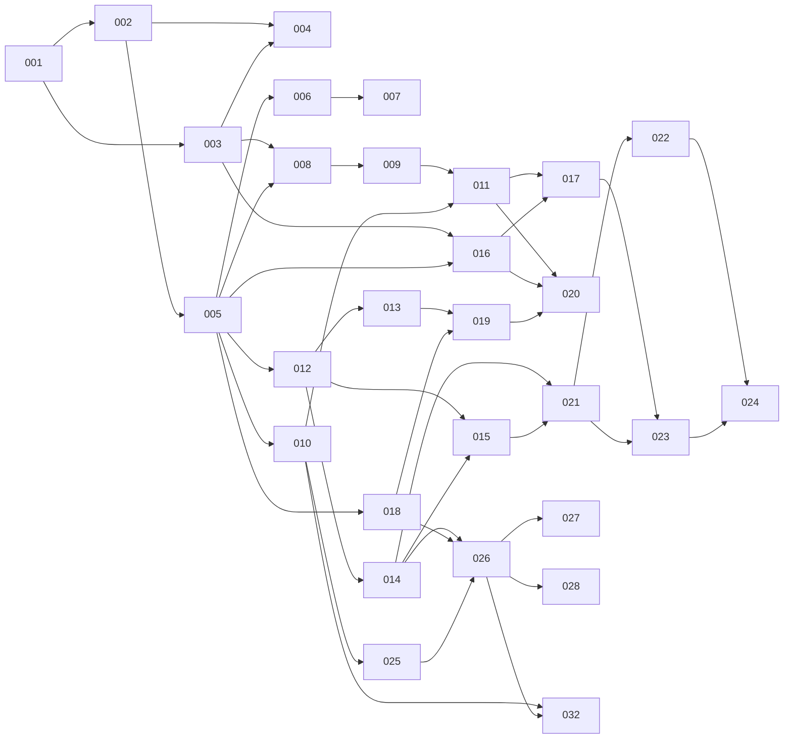

# Straticate Roadmap

This is the feature ledger and dependency graph for Straticate. It must be kept
current: every feature PR updates its own ledger row (status, branch, PR).

Feature numbers are zero-padded, sequential, and **never reused**. The number
appears in the branch name (`NNN-short-description`), the PR title
(`[NNN] Title`), and the feature document (`docs/features/NNN-*.md`).

Statuses: `PLANNED → READY → IN PROGRESS → PR OPEN → MERGED` (plus `BLOCKED`).

## Milestones

### M1 — Fake-separator end-to-end (first major technical milestone)

The complete workflow, with **no real ML model**:

```text
Open Straticate → drag/drop audio → upload succeeds → metadata appears
→ select separation mode → start job → fake inference begins
→ real-time WebSocket progress → model/GPU-style telemetry → cancel works
→ job completes → placeholder stems appear → preview (solo/mute/seek) works
→ export works
```

**Formal acceptance:** a person can run backend + frontend locally per
DEVELOPMENT.md and perform every step above against the fake separator, with
all normal CI green, on a machine with no GPU. Requires features 001–024.

### M2 — First real separation

HQ vocal separation (RoFormer-family) on CUDA with CPU fallback, verified
model download, real chunk progress, real telemetry. Features 025–026.

### M3 — v0.1.0 release

Fast + HQ vocal models, 4-stem model, capability-driven mode selection,
production build, release automation. Release PR `dev → main`, tag `v0.1.0`.

## Current state (2026-08-24)

**Milestones M1 and M2 are both met.** Features 001–026 plus 029 and 031 are
merged. **693 backend tests and 517 frontend tests**, all CI-enforced, the
backend suite clean under `-W error`.

### M2 — first real separation

Straticate performs a genuine vocal separation. A vendored Mel-Band RoFormer
(MIT) runs the Kim Vocal 2 checkpoint (MIT since 2026-04-22) behind the
existing `Separator` seam, with weights installed and SHA-256-verified by
feature 025.

**Separation quality, measured against ground truth** — a 20 s mixture built
from a locally synthesised speech track over a generated backing, so the true
sources were known:

| correlation | value |
| --- | --- |
| vocals stem ↔ true voice | **+0.993** |
| vocals stem ↔ true backing | −0.001 |
| instrumental stem ↔ true backing | **+1.000** |
| instrumental stem ↔ true voice | +0.003 |
| *mixture* ↔ true voice (baseline) | +0.231 |

The mixture correlates with the voice at 0.23 and the extracted stem at 0.99:
separation, not a passthrough. The baseline row is what makes it a measurement
rather than a number.

**CUDA is verified.** Executed 2026-08-25 on an NVIDIA GeForce RTX 4060 Laptop
GPU (8188 MiB, driver 610.47 / CUDA 13.3) with `torch 2.13.0+cu130`. Feature
018's design held exactly as written — swapping the wheel made `cuda:0` appear
first with **no code, settings, API or schema change**, and jobs resolved to it
automatically.

| | CPU | cuda:0 |
| --- | --- | --- |
| 30 s clip, wall clock | 100.5 s | **6.7 s** |
| real-time factor | 0.299 | **4.496** |
| gpu telemetry block | `null` (correct CPU shape) | measured |

**~15× faster than CPU, and faster than real time** — a 3-minute track separates
in about 40 s instead of 10 minutes. Measured VRAM on that run: 1,082 MiB
allocated, **1,634 MiB peak** of 8,188 MiB — a short-clip figure; see 036 for
how it scales. With `nvidia-ml-py` present the optional NVML
fields report too (utilization 1.0, 59–62 °C); without it they are `null`, which
the contract permits.

The full integration tier passes (4/4), including the previously-never-executed
`@pytest.mark.gpu` test, and a job driven through the real API resolved to
`cuda:0`, reported real chunk progress, and delivered a `runtime_metrics` event
carrying genuine GPU figures over the WebSocket.

Four defects that only a GPU could reveal are recorded as feature **036** —
notably the catalog's `recommended_vram_mb: 8192`, which was never measured.
**036 re-measured it and the "wrong by more than 5×" reading above did not
survive**: peak allocation is not bounded by chunking (it grows ~1.35 MiB per
second of audio, reaching 2,343 MiB on a 10-minute track), and what a card must
have free is roughly twice the allocated figure once the CUDA context and the
allocator's reservation are counted — 4,213 MiB for that track. The corrected
entry is `recommended_vram_mb: 6144` with a new `minimum_vram_mb: 4096` floor;
036's document carries the method and the full sweeps.


### M1 — fake-separator end-to-end

Met earlier the same day and verified by hand in a browser: upload → catalog-driven
configuration → job → live chunk progress → telemetry → cancel → synchronized
stem playback with solo/mute/seek → export. See the git history of this section.

### Next

- **027** (MDX fast tier) — the CPU story, now narrowed to the `vocals` mode:
  RoFormer is 3.5–5× slower than real time on CPU, while 028's four-stem model
  measures **1.6× faster** than real time on the same host, so `standard_stems`
  already has a usable CPU story and `vocals` does not.
- **028** (4-stem separation) is **in review** — `standard_stems` has a real
  model again, `standard-stems-001` (Hybrid Transformer Demucs), claiming
  `balanced` and leaving `high_quality` free for a bagged checkpoint later.
  **027** still has the tier problem this note was about: `vocals` has no free
  tier left, so `fake-vocals-001` must be retiered or dropped in that PR. See
  `docs/features/032-hide-development-models.md`.
- **030** (Playwright E2E tier) — overdue since M1; it would have caught two
  M1 defects that unit tests did not.
- Whether `quality_options` should hide tiers whose weights are not installed
  is **settled by 037: no.** Raised by 010 and deferred by 025, 026 and 032.
  Hiding makes the product silently differ from machine to machine, and on a
  default server — one mode, one real tier — it would empty the configure step
  with no explanation. The tier is also the only place a model's price, its
  hardware requirements and its licence can be read *before* the download, and
  the failure hiding was meant to prevent has been prevented directly since
  035, which disables "Start separation" with a stated reason until the weights
  are there. 037 acts on the decision rather than only recording it: every tier
  is now priced where it is chosen ("Needs a 870 MB download" / "Installed" /
  "Downloading its weights…" / "Its last install failed"), from `GET /models`,
  so a mode with several uninstalled tiers no longer has to be clicked through.
  Reasoning in `docs/features/037-model-management-ui.md`.
- **032 hides the development fixtures** from the user-facing catalog. Between
  032 and 028 a default server therefore offered a single separation mode
  (`vocals`, tier `high_quality`, `vocals-hq-001`) and `standard_stems` was
  absent entirely, having only a fixture behind it. Since 028 both modes are
  served — `standard_stems` at `balanced` via `standard-stems-001` — and a fresh
  checkout still requires a weights install (870 MiB or 80 MiB) before it can
  separate anything. `STRATICATE_INCLUDE_DEVELOPMENT_MODELS=1` restores the
  previous behaviour and is what CI, the backend suite and 030's Playwright tier
  set. A first-run install affordance is another thing waiting on the unclaimed
  model-management UI.

## Feature ledger

| #   | Feature                                      | Status  | Depends on | Branch | PR |
|-----|----------------------------------------------|---------|------------|--------|----|
| 001 | Repository bootstrap (docs, contracts, plan) | MERGED  | —          | `001-repository-bootstrap` | #1 |
| 002 | Backend skeleton (FastAPI, tooling, health)  | MERGED  | 001        | `002-backend-skeleton` | #2 |
| 003 | Frontend skeleton (Vite/React/TS, shell)     | MERGED  | 001        | `003-frontend-skeleton` | #3 |
| 004 | CI pipeline (backend + frontend checks)      | MERGED  | 002, 003   | `004-ci-pipeline` | #4 |
| 005 | API contracts v1 (schemas, OpenAPI → TS)     | MERGED  | 002        | `005-api-contracts` | #5 |
| 006 | Audio upload + validation + temp storage     | MERGED  | 005        | `006-audio-upload` | #6 |
| 007 | Audio metadata extraction (ffprobe)          | MERGED  | 006        | folded into 006 | #6 |
| 008 | Drag-drop + file picker + upload state UI    | MERGED  | 003, 005   | `008-drag-drop-ui` | #7 |
| 009 | Metadata display UI                          | MERGED  | 008        | `009-metadata-display` | #10 |
| 010 | Model catalog + capabilities backend         | MERGED  | 005        | `010-model-catalog` | #11 |
| 011 | Separation mode + quality selection UI       | MERGED  | 009, 010*, 015, 016 | `011-mode-selection-ui` | #19 |
| 012 | Job manager (queue, states, cancellation)    | MERGED  | 005        | `012-job-manager` | #8 |
| 013 | WebSocket event hub + typed events           | MERGED  | 012        | `013-websocket-hub` | #13 |
| 014 | Separator interface + FakeSeparator          | MERGED  | 012        | `014-fake-separator` | #15 |
| 015 | Job REST endpoints (create/get/cancel/list)  | MERGED  | 012, 014   | `015-job-endpoints` | #17 |
| 016 | Frontend job + WebSocket clients             | MERGED  | 003, 005*  | `016-job-ws-clients` | #14 |
| 017 | Progress UI + cancel + error handling        | MERGED  | 011, 015, 016 | `017-progress-cancel-ui` | #23 |
| 018 | Compute device detection + devices API       | MERGED  | 005        | `018-device-detection` | #12 |
| 019 | Runtime telemetry sampler + metrics events   | MERGED  | 013, 018   | `019-telemetry-sampler` | #21 |
| 020 | Telemetry panel UI (model/GPU/processing)    | MERGED  | 011, 016, 019* | `020-telemetry-panel` | #22 |
| 021 | Result management + stem serving             | MERGED  | 014, 015   | `021-result-serving` | #20 |
| 022 | Stem export (WAV24/float32/FLAC)             | MERGED  | 021        | `022-stem-export` | #25 |
| 023 | Stem player UI (sync playback, solo, mute)   | MERGED  | 017, 021   | `023-stem-player` | #26 |
| 024 | Export UI                                    | MERGED  | 022, 023   | `024-export-ui` | #27 |
| 025 | Model download manager (SHA-256, atomic)     | MERGED  | 010        | `025-model-download-manager` | #30 |
| 026 | Real separator: HQ vocals (Mel-Band RoFormer)| MERGED  | 014, 018, 025 | `026-roformer-separator` | #33 |
| 027 | Real separator: fast vocals (MDX-family)     | WONTFIX | 026        | | licence unstated — see docs/features/027 |
| 028 | 4-stem separation (Demucs)                   | MERGED  | 026        | `028-demucs-four-stem` | #45 |
| 029 | Skeleton hardening (deferred review finds)  | MERGED  | 004, 005   | `029-skeleton-hardening` | #29 |
| 030 | Playwright E2E tier (fake separator)         | MERGED  | 024        | `030-playwright-e2e` | #35 |
| 031 | Post-029 review findings                     | MERGED  | 029        | `031-post-029-findings` | #32 |
| 032 | Keep development models out of user catalog  | MERGED  | 010, 026   | `032-hide-development-models` | #36 |
| 033 | Session survives a page reload               | MERGED  | 016, 017   | `033-session-survives-reload` | #39 |
| 034 | Lazy separator builders (torch optional again)| MERGED  | 026        | `034-lazy-separator-builders` | #40 |
| 035 | First-run model install affordance (UI)      | MERGED  | 025, 032   | `035-install-affordance` | #41 |
| 036 | GPU validation follow-ups                    | MERGED  | 026, 029   | `036-gpu-validation-followups` | #42 |
| 037 | Model management UI (install/remove/browse)  | MERGED  | 025, 035   | `037-model-management-ui` | #44 |
| 038 | Streaming overlap-add (bounded VRAM)         | PLANNED | 026        | | |
| 039 | Shared separator skeleton (de-duplicate)     | PR OPEN | 026, 028   | `039-shared-separator-skeleton` | #48 |
| 040 | Free-disk-space endpoint for installs        | PR OPEN | 025, 037   | `040-free-disk-space-endpoint` | |

`*` = depends only on that feature's *contract* (schemas/mocks), not its
implementation — the frontend feature may proceed against documented contracts,
generated types, and mock responses/events.

## Dependency graph



## Parallel tracks

Backend and frontend proceed in parallel once a contract exists. Shared
contracts are established **first** (feature 005 and per-feature schema
additions); two agents never independently redefine the same contract.

```text
Backend track                      Frontend track
─────────────                      ──────────────
002 backend skeleton          ∥    003 frontend skeleton
005 API contracts v1               (frontend consumes generated types)
006 upload · 007 metadata     ∥    008 drop/picker UI · 009 metadata UI
010 model catalog             ∥    011 mode/quality selection
012 jobs · 013 WS · 014 fake  ∥    016 job/WS clients · 017 progress UI
018 devices · 019 telemetry   ∥    020 telemetry panel
021 results · 022 export      ∥    023 stem player · 024 export UI
```

Safe concurrency rule of thumb: features in different tracks with all
dependencies MERGED (or contract-only `*` dependencies documented) may run
simultaneously. Features touching `backend/src/straticate/schemas/` serialize
with each other.

## Phases (development plan)

- **Phase 0 — Repository:** 001, 002, 003, 004
- **Phase 1 — Contracts & skeletons:** 005 (plus 002/003 hardening)
- **Phase 2 — File ingestion:** 006, 007, 008, 009
- **Phase 3 — Separation configuration:** 010, 011
- **Phase 4 — Job infrastructure:** 012, 013, 014, 015, 016, 017
- **Phase 5 — Telemetry:** 018, 019, 020
- **Phase 6 — Results (fake stems):** 021, 022, 023, 024 → **M1**
- **Phase 7 — Real inference:** 025, 026 → **M2**
- **Phase 8 — Additional models:** 027, 028
- **Phase 9 — Model management UI, remote catalog, updates/removal** (features
  numbered when planned)
- **Phase 10 — Release:** production build, deployment docs, release
  automation → **v0.1.0** (M3)

Note the deliberate ordering: results/preview/export (Phase 6) is built against
the fake separator *before* real inference (Phase 7), so M1 proves the entire
application shell without ML risk.

## Initial agent assignments

| Agent | Feature | Notes |
| --- | --- | --- |
| Agent A (backend) | 002 | then 005 (contracts are backend-owned) |
| Agent B (frontend) | 003 | then 008 once 005's contracts merge |
| Agent C (infra) | 004 | after 002 + 003 merge |

Every assignment must follow the template in [AGENTS.md](AGENTS.md): feature
number, title, branch, objective, dependencies, scope, out-of-scope, expected
files, acceptance criteria, required tests.
